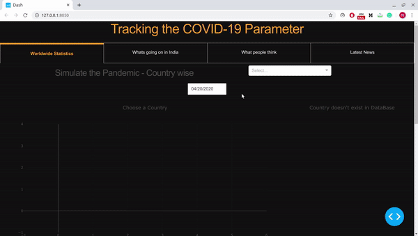

# Tracking the COVID 19 Pandemic 

**Disclaimer : This is a simple personal project I had done and please do not consider the predictions as real just as the famous quote ```"All models are wrong, but some are useful"```.**

## Key Features

**World Wide Stats**

- Simulating the pandemic for different countries (individually)
- Heat map of the number of active cases over time for the next 60 days. 
- Interactive Pie Chart for viewing the countries having a higher number of active cases, deaths, recoveries.
  
**Stats in India**

- Simulating the cases in each state
- Heat map of active cases in India
- Racing Bar graph to simulate cases in every state in India
- Comparing the trend of top 5 affected states in India with the overall trend of the entire country

**What people think**

- Sentiment Analysis by streaming tweets related to the pandemic.
- The graph plots the average sentiment so far.
- Pie chart ot view the absolute number of positive, negative and nuetral tweets.
- Updating table with color highlighting based on sentiment of the tweet.
- Positive and negative word cloud which automatically get updated over time.

**News**

- Scraping news about the pandemic from different countries with a short description of the same.


## Quick walkthrough of the same



Simulating the pandemic in different countries ( worldwide statistics ) deployed on Heroku [link](https://covid-19-forecast.herokuapp.com). Didn't add the others cause the deployed app is unable to handle real time updates.

## To run locally

```pip3 install --user -r requirements.txt```

```python3 app.py```

