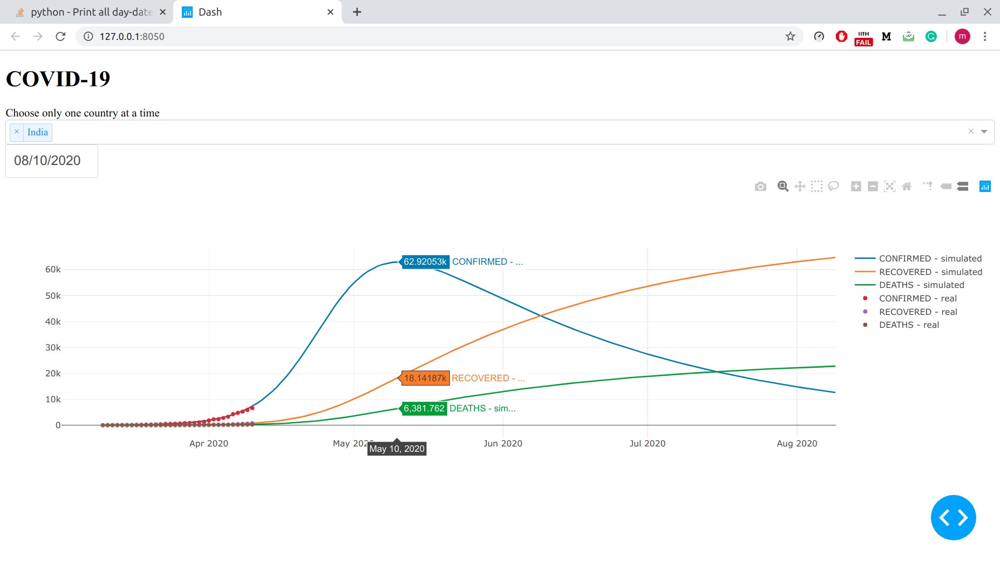
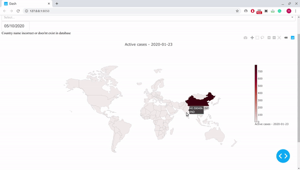
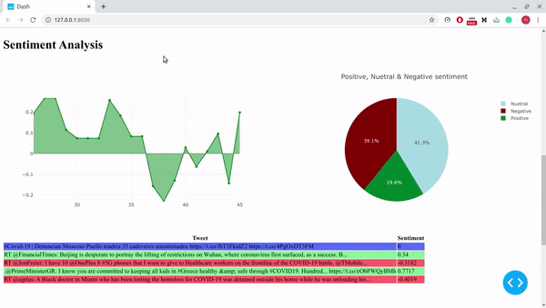

# Covid-19

Forcasting the Covid - 19 Pandemic

**To Run**

```python3 app.py```

**Some results**

**India**



The model has done pretty well and will keep improving as it gets more and more data. But for cases like USA where the cases suddenly spiked up, the model has a comparatively large error but I am sure it will eventually be able to fit to the data.

**World Map - Heat map for active cases (forecasted) from start till 60 days from now**



**Sentiment Analysis**

